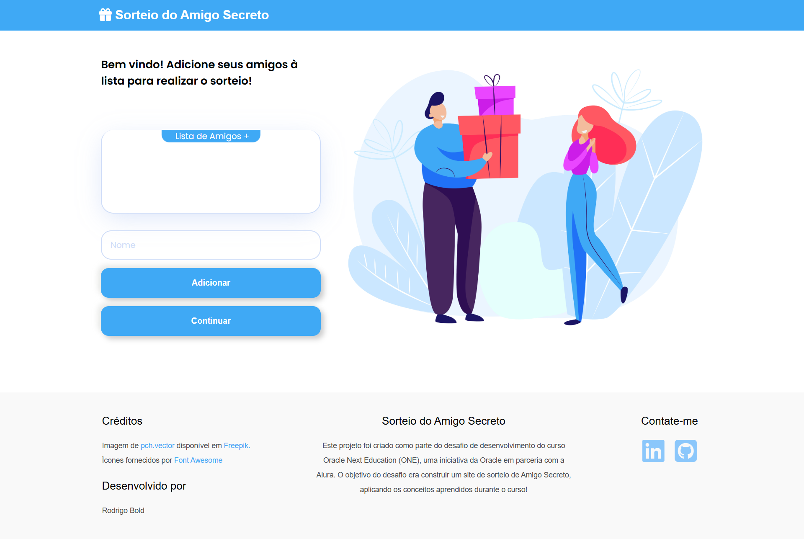

# Sorteio de Amigo Secreto


## 📜 Índice

- [Descrição](#-descrição)
- [Funcionalidades do Projeto](#-funcionalidades-do-projeto)
- [Tecnologias Utilizadas](#-tecnologias-utilizadas)
- [Objetivos do Desafio](#-objetivos-do-desafio)
- [Como Usar](#-como-usar)
- [Responsividade](#-responsividade)
- [Créditos](#-créditos)

## 📝 Descrição
Este projeto foi criado como parte do desafio de desenvolvimento do curso Oracle Next Education (ONE), uma iniciativa da Oracle em parceria com a Alura. O objetivo do desafio era construir um site de sorteio de Amigo Secreto, aplicando os conceitos aprendidos durante o curso!

## 🚀 Funcionalidades do Projeto

- ✅ Adicione nomes de participantes à lista de sorteio  
- 🎉 Realize o sorteio garantindo que ninguém tire o próprio nome  
- 👥 Interface para revelar os pares de forma individual
- ✏️ Edição e remoção de participantes já adicionados
- 🔒 Opção de esconder/mostrar o nome do amigo sorteado  
- 🎊 Animação de confetes ao revelar cada amigo secreto
- 📱 Design responsivo para desktop e dispositivos móveis

## 🛠️ Tecnologias Utilizadas
- HTML5  
- CSS3  
- JavaScript (Vanilla)  

<br>

<span></span> 
<span></span> 
<span></span> 


## 📚 Bibliotecas utilizadas
- [Font Awesome](https://fontawesome.com/) (via CDN) – Para animações de confetes
- [Canvas-confetti](https://cdn.jsdelivr.net/npm/canvas-confetti) (via CDN) – Para ícones 


## 🎯 Objetivos do Desafio

### 1️⃣ Array para armazenar nomes 

- Array `participants` declarada para armazenar a lista de amigos 
    <details>
    <summary>Código</summary>
    <br>

    ```javascript
    let participants = [];
    ```
    </details>

### 2️⃣ Função para adicionar amigos 

`insertFriend()`  

- Captura o campo de entrada 
- Valida campos vazios
- Exibe alertas para erros  
- Atualiza o array de amigos  
- Limpa o campo após adição  

    <details>
    <summary>Código</summary>
    <br>

    ```javascript
    function insertFriend() { 
        const inputName = document.getElementById('inputField'); 
        const normalizedName = inputName.value.trim(); 
        if (normalizedName === '') { 
            showAlertMessage("Por favor, insira um nome!"); 
        } else if (participants.map(p => p.toLowerCase()).includes(normalizedName.toLowerCase())) { 
            showAlertMessage(`${normalizedName} já está na lista!`); 
        } else { 
            participants.push(normalizedName); 
            updateFriendsList(); 
            inputName.value = ''; 
        } 
    }
    ```
    </details>


### 3️⃣ Função para atualizar a lista de amigos 

`updateFriendsList()`

- Obtém o elemento da lista  
- Limpa a lista existente  
- Percorre o array de amigos  
- Adiciona elementos à lista HTML  

    <details>
    <summary>Código</summary>
    <br>

    ```javascript
    function updateFriendsList() { 
        const list = document.getElementById('participantsList'); 
        list.innerHTML = ''; 
        participants.forEach((friend, index) => { 
            list.prepend(createParticipantItem(friend, index)); 
        }); 
    }
    ```
    </details>

### 4️⃣ Funções para sortear os amigos 
`generatePairs()`  

- Valida a disponibilidade de amigos  
- Gera índices aleatórios  
- Obtém o nome sorteado  

    <details>
    <summary>Código</summary>
    <br>

    ```javascript
    function generatePairs(participants) { 
        if (participants.length < 2) { 
            showAlertMessage("Por favor, adicione mais amigos!"); 
            return; 
        } 
        let pickedFriends; 
        let isValid = false; 
        while (!isValid) { 
            pickedFriends = [...participants]; 
            shuffleArray(pickedFriends); 
            isValid = pickedFriends.every((friend, index) => friend !== participants[index]); 
        } 
        const friendsPairs = {}; 
        participants.forEach((participant, index) => { 
            friendsPairs[participant] = pickedFriends[index]; 
        }); 
        return friendsPairs; 
    }
    ```
    </details>

`revealSecretFriend()`  

- Exibe o resultado do sorteio   

    <details>
    <summary>Código</summary>
    <br>

    ```javascript
    function revealSecretFriend(button) {
        if (currentPairIndex < entries.length) {
            const [drawer, friend] = entries[currentPairIndex];
            displayDrawResult(drawer, friend);
            // O restante do código continua...
        }
    }
    ```
    </details>

## 🎮 Como Usar

### 📂 Clonando o Repositório
1. Clone o repositório:  
   `git clone https://github.com/seu-usuario/sorteio-amigo-secreto.git`

2. Abra o arquivo `index.html` no seu navegador ou hospede os arquivos em um servidor web.

### ➕👫 Adicionando Participantes
- Adicione os nomes dos participantes no campo "Nome".
- Para editar um nome já adicionado, clique no ícone de edição ou dê um duplo clique no nome
- Para remover um participante, clique no ícone de lixeira

### 🎲 Iniciando o Sorteio
- Clique em "Continuar" para iniciar o sorteio. O sistema irá garantir que ninguém tire o próprio nome.

### ✨  Revelando o Amigo Secreto
- Clique em "Preparar" para ver quem será o próximo a sortear.
- Clique em "Sortear" para revelar o amigo secreto.
- Use o botão "Ocultar" para esconder o resultado antes de passar o dispositivo.
- Clique em "Reiniciar" para começar um novo sorteio após todos verem seus resultados.

## 📱 Responsividade
O aplicativo foi projetado para funcionar em:

- 💻 Desktops e laptops  
- 📱 Tablets  
- 📲 Smartphones e dispositivos móveis

## 👥 Créditos
- Imagens: [pch.vector](https://www.freepik.com/author/pch-vector) via [Freepik](https://www.freepik.com/)  
- Ícones: [Font Awesome](https://fontawesome.com/)  
- Efeitos: [Canvas-confetti](https://cdn.jsdelivr.net/npm/canvas-confetti)  
- Desenvolvido por: [Rodrigo Bold](https://www.linkedin.com/in/rodrigo-bold/)

<br>

