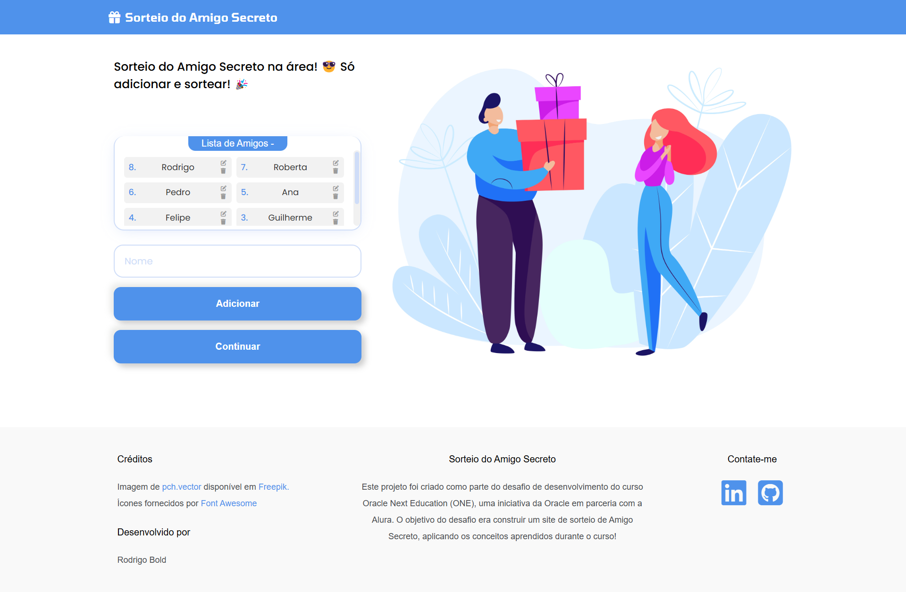

# Sorteio de Amigo Secreto


## 📜 Índice

- [Descrição](#-descrição)
- [Funcionalidades do Projeto](#-funcionalidades-do-projeto)
- [Tecnologias Utilizadas](#-tecnologias-utilizadas)
- [Como Usar](#-como-usar)
- [Algoritmo de Sorteio](#-algoritmo-de-sorteio)
- [Responsividade](#-responsividade)
- [Créditos](#-créditos)

## 📝 Descrição
Um aplicativo web interativo para realizar sorteios de amigo secreto de forma simples. Desenvolvido como parte do desafio do curso Oracle Next Education (ONE), uma iniciativa da Oracle em parceria com a Alura. O aplicativo permite organizar sorteios de amigo secreto, facilitando a distribuição aleatória de pares entre os participantes.

## 🚀 Funcionalidades do Projeto

- ✅ Adicione nomes de participantes à lista de sorteio  
- 🎉 Realize o sorteio garantindo que ninguém tire o próprio nome  
- 👥 Interface para revelar os pares de forma individual (ideal para usar em um único dispositivo compartilhado)  
- 🔒 Opção de esconder/mostrar o nome do amigo sorteado  
- 📱 Design responsivo para desktop e dispositivos móveis

## 🛠️ Tecnologias Utilizadas
- HTML5  
- CSS3  
- JavaScript (Vanilla)  
- Font Awesome (ícones)

<br>

<span></span> 
<span></span> 
<span></span> 
<span></span>
## 🎮 Como Usar

### 📥 Clonando o Repositório
1. Clone o repositório:  
   `git clone https://github.com/seu-usuario/sorteio-amigo-secreto.git`

2. Abra o arquivo `index.html` no seu navegador ou hospede os arquivos em um servidor web.

### 📝 Adicionando Participantes
- Adicione os nomes dos participantes no campo "Nome".

### 🎲 Iniciando o Sorteio
- Clique em "Continuar" para iniciar o sorteio. O sistema irá garantir que ninguém tire o próprio nome.

### 👥 Revelando o Amigo Secreto
- Clique em "Preparar" para ver quem será o próximo a sortear.
- Clique em "Sortear" para revelar o amigo secreto.
- Use o botão "Ocultar" para esconder o resultado antes de passar o dispositivo.

## 🧠 Algoritmo de Sorteio
O aplicativo utiliza um algoritmo que garante:

- Distribuição aleatória dos pares  
- Nenhum participante sorteia o próprio nome  
- Cada pessoa é sorteada exatamente uma vez

```javascript
// Função que gera pares para o sorteio do Amigo Secreto
function generatePairs(participants) {
    // Verifica se há pelo menos 2 participantes. Se não, exibe um alerta.
    if (participants.length < 2) {
        showAlertMessage("Por favor, adicione mais amigos!"); 
        return; 
    }

    let pickedFriends; // Variável para nova lista de participantes que será embaralhada
    let isValid = false; // Variável para garantir que o sorteio seja válido (ninguém pode se tirar)

    // Tenta gerar um sorteio válido até que todos os participantes tenham amigos diferentes
    while (!isValid) {
        pickedFriends = [...participants]; // Cria uma cópia da lista original de participantes
        shuffleArray(pickedFriends); // Chama a função shuffleArray para embaralhar a lista copiada para gerar novos pares

        // Verifica se ninguém se tirou no sorteio (cada participante não pode ser seu próprio amigo secreto)
        isValid = pickedFriends.every((friend, index) => friend !== participants[index]);
    }

    // Cria um objeto para armazenar o amigo secreto de cada participante
    let friendsPairs = {}; 

    // Mapeia cada participante para o seu amigo secreto
    participants.forEach((participant, index) => {
        // Adiciona no objeto o participante e o seu respectivo amigo secreto
        friendsPairs[participant] = pickedFriends[index];
    });

    // Retorna o objeto com todos os pares de amigo secreto
    return friendsPairs;
}
```

## 📱 Responsividade
O aplicativo foi projetado para funcionar em:

- 💻 Desktops e laptops  
- 📱 Tablets  
- 📲 Smartphones e dispositivos móveis

## 👥 Créditos
- Imagens: pch.vector via Freepik  
- Ícones: Font Awesome  
- Desenvolvido por: Rodrigo Bold


⭐ Gostou do projeto? Deixe uma estrela no repositório!
